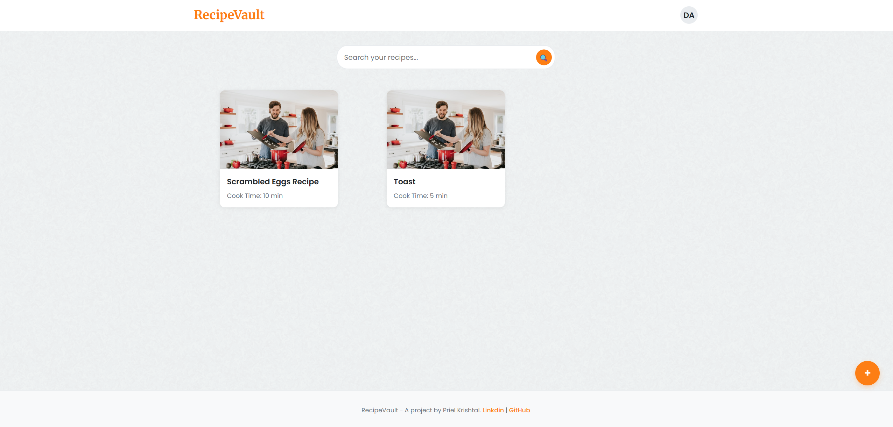
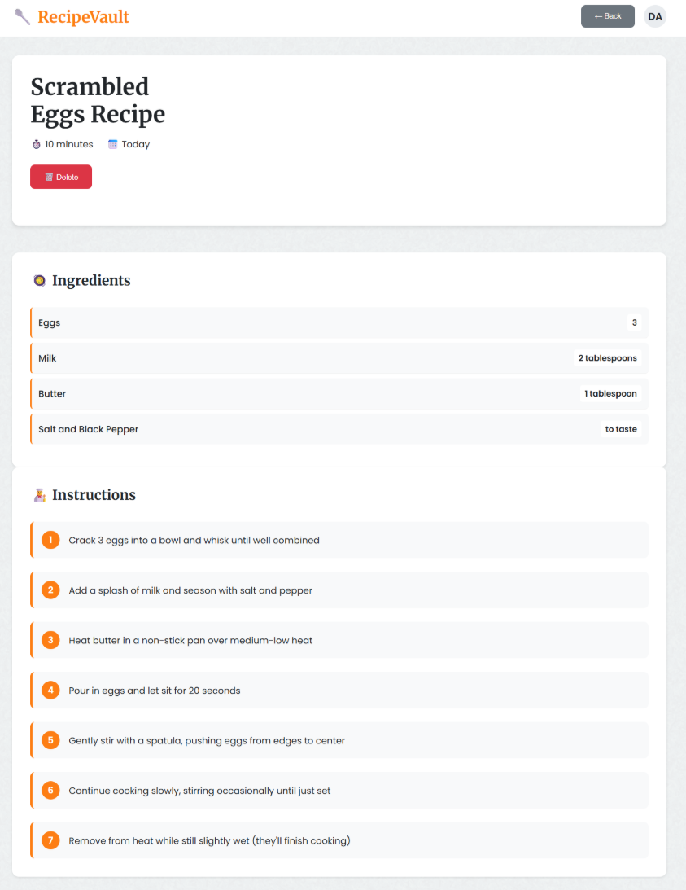
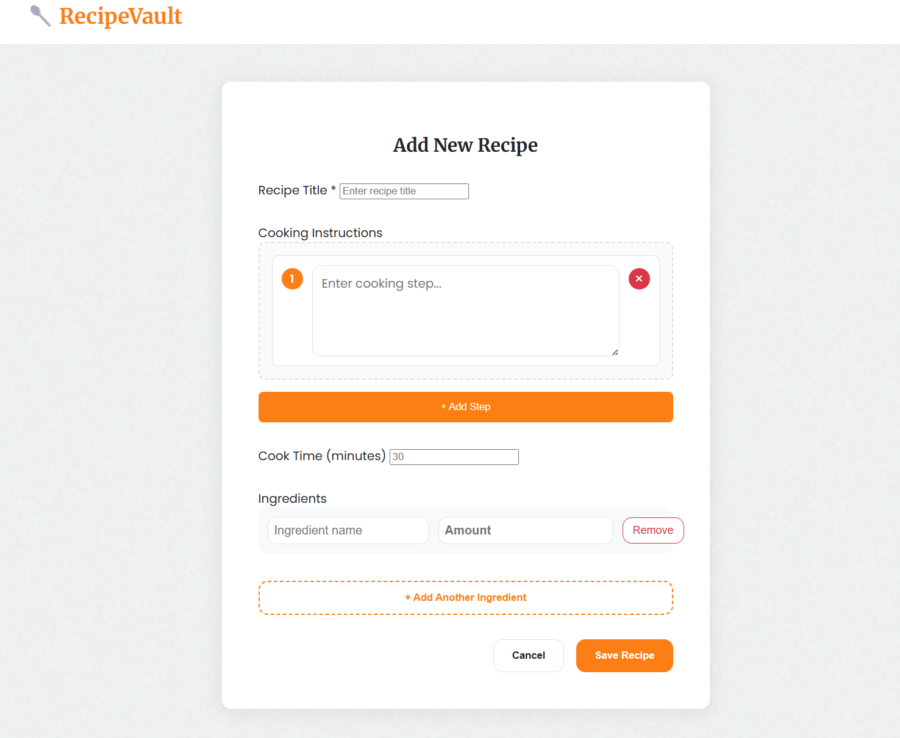
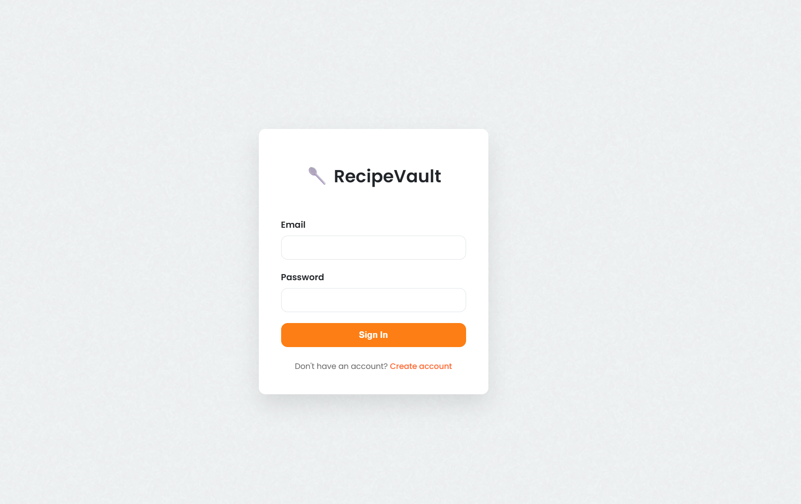

# RecipeVault - Recipe Management API


RecipeVault is a full-stack recipe management application featuring a modern REST API built with FastAPI and Python. The application provides secure user authentication, comprehensive recipe management with ingredient relationships, and a clean web interface for recipe creation and discovery.

## 🎨 Application Screenshots


*Main dashboard showing user recipes with search functionality*



*Detailed recipe view with ingredients and instructions*


*Clean recipe creation interface with ingredient management*


*Secure authentication with registration modal*

## 🚀 Live Features

- **🔐 JWT Authentication**: Secure user registration and login with JWT bearer tokens and password hashing
- **📝 Complete Recipe CRUD**: Create, read, update, and delete user-owned recipes with full authorization
- **🥘 Smart Ingredient Management**: Many-to-many relationships linking recipes to a shared ingredient database
- **🔍 Multilingual Search**: Search recipes in both English and Hebrew with intelligent query handling
- **👤 User Isolation**: Protected endpoints ensuring users can only access their own recipes
- **📱 Responsive UI**: Clean, modern web interface with real-time feedback and loading states
- **📚 Auto-Generated Docs**: Interactive API documentation available at `/docs`

## 🛠 Tech Stack

### Backend

- **FastAPI** - Modern, fast web framework for building APIs
- **SQLAlchemy** - Python SQL toolkit and Object-Relational Mapping
- **PostgreSQL** - Production-grade relational database
- **Pydantic** - Data validation using Python type annotations
- **JWT & Passlib** - Secure authentication and password hashing

### Frontend

- **Vanilla JavaScript** - ES6+ with Fetch API for backend communication
- **HTML5 & CSS3** - Semantic markup with modern CSS features
- **Responsive Design** - Mobile-first approach with flexible layouts

### Deployment

- **Docker** - Containerized application with PostgreSQL database
- **Docker Compose** - Multi-service orchestration for development

## 🏗 Architecture Highlights

### Database Schema

```
Users (1:Many) → Recipes (Many:Many) → Ingredients
```

- **Users**: Isolated user accounts with secure authentication
- **Recipes**: User-owned recipes with full metadata
- **Ingredients**: Shared ingredient pool with amount tracking per recipe
- **RecipeIngredients**: Junction table managing recipe-ingredient relationships

### API Design

- **RESTful endpoints** following HTTP conventions
- **Proper status codes** (200, 201, 401, 404, etc.)
- **Request/Response validation** with Pydantic schemas
- **Error handling** with meaningful error messages

## 📁 Project Structure

```
recipe-api/
├── app/
│   ├── routers/
│   │   ├── auth.py          # Authentication endpoints
│   │   └── recipes.py       # Recipe CRUD & search
│   ├── models.py            # SQLAlchemy database models
│   ├── schemas.py           # Pydantic request/response schemas
│   ├── security.py          # JWT & password utilities
│   └── main.py              # FastAPI app initialization
├── static/                  # Frontend files
│   ├── recipes.html         # Main dashboard
│   ├── add.html            # Recipe creation form
│   ├── view_recipe.html    # Recipe details view
│   └── style.css           # Application styles
├── docker-compose.yml       # Multi-service configuration
├── Dockerfile              # Container configuration
└── requirements.txt         # Python dependencies
```

## 🚀 Quick Start

### Using Docker (Recommended)

```bash
# Clone the repository
git clone [your-repo-url]
cd recipe-api

# Start the application
docker-compose up --build

# Access the application
open http://localhost:8000/static/login.html
```

### Local Development

```bash
# Install dependencies
pip install -r requirements.txt

# Start the API server
uvicorn app.main:app --reload

# Access at http://localhost:8000/static/login.html
```

## 🎯 API Endpoints

### Authentication

- `POST /auth/register` - User registration
- `POST /auth/login` - User authentication
- `GET /auth/users/me` - Get current user info

### Recipes

- `GET /recipes/` - List user's recipes
- `POST /recipes/` - Create new recipe
- `GET /recipes/{id}` - Get recipe details
- `DELETE /recipes/{id}` - Delete recipe
- `GET /recipes/search/` - Search recipes

## 🎨 Key Features Showcase

This project demonstrates:

- **Modern API Development** with FastAPI's automatic documentation and validation
- **Database Relationships** with proper many-to-many modeling
- **Security Best Practices** including JWT authentication and user authorization
- **Full-Stack Integration** with a responsive frontend consuming the API
- **Multilingual Support** for diverse user bases
- **Clean Architecture** with separation of concerns and modular design
- **Containerization** with Docker for consistent deployment

## 🔮 Future Enhancements

- [ ] Recipe categories and tags
- [ ] Recipe sharing between users
- [ ] Image upload functionality
- [ ] Recipe rating system
- [ ] Export recipes to PDF
- [ ] Unit test coverage
- [ ] CI/CD pipeline

## 🤝 Contributing

Feel free to fork this project and submit pull requests for any improvements.
